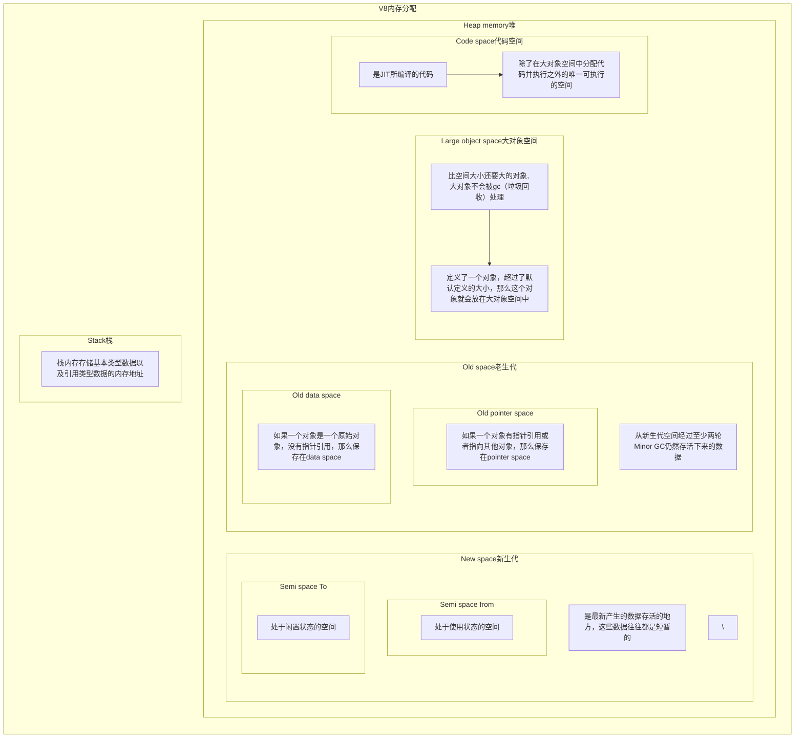

<!--more-->

---

---
小知识，大挑战！本文正在参与“[程序员必备小知识](https://juejin.cn/post/7008476801634680869 "https://juejin.cn/post/7008476801634680869")”创作活动。

# 内存控制

`JavaScript`通过**垃圾回收机制**来进行自动内存管理，使得开发者不需要像`C/C++`一样在编写代码的过程中时刻关注内存的分配和释放。

在浏览器中进行开发时，几乎很少有人会遇到垃圾回收对应用构成性能影响的情况。

`Node`极大地拓宽了`JavaScript`的应用场景，当主流应用场景从**客户端**延伸到**服务器端**之后，能发现，对于性能敏感的服务器程序，内存管理的好坏、垃圾回收状况是否优良，都会对服务构成影响。

### 为什么关注内存问题

* 防止页面占用内存过大，引起客户端卡顿，甚至无响应（浏览器端）
* Node使用的也是V8，内存对后端服务的性能至关重要。因为服务的持久性，后端容易造成内存溢出

***
## Node与V8

在`Node`中，这一切都与Node的JavaScript执行引擎V8息息相关。 Node在发展历程中离不开V8，在Node的官网介绍中也是说：`Node.js 是一个基于 Chrome V8 引擎的 JavaScript 运行时`

在当初Node创始人`Ryan Dahl`选择V8作为Node的JavaScript脚本引擎，原因是来自当时第三次浏览器大战，在其中Chrome以JavaScript引擎V8成为性能优异的焦点，并且在接下来的性能跑分中，V8持续领跑。 我曾经在[《时代变了，程序员の老冤家IE浏览器离场啦？！》](https://juejin.cn/post/6975821911678779406) 中讲过前两次大战，第三次大战主要是以**Chrome**的胜利为结束。

## V8引擎

V8引擎的开发领导者是`Lars Bak`，第一个版本和Chrome的第一版一起在2008年9月2日发布。

`Lars Bak`的工作履历大部分是从事与虚拟机相关的工作，主要致力于开发高性能的Java虚拟机，开发者的这些经历也让V8诞生时就超越了当时所有的JavaScript虚拟机。 

V8引擎是由C++编写的。

V8引擎的垃圾回收机制：
* 在V8的内存分配中分为堆和栈
  - 栈内存存储基本类型数据以及引用类型数据的内存地址
  - 堆内存储存引用类型的数据
* 垃圾回收主要存在于堆的新生代和老生代
* 新生代中分为两个空间，`Semi space from`和`Semi space To`，这两个空间严格对半分
* 老生代:从新生代空间经过至少两轮`Minor GC`仍然存活下来的数据
* 内存大小与操作系统有关，`64位`是`1.4G`，`32位`是`0.7G`
  - 64位新生代空间是`64MB`，老生代为`1400MB`
  - 32位新生代空间是`32MB`，老生代为`700MB`
  - 新版的Node在v14之后，内存已经有2G了
* 新生代和老生代用的是两种完全不同的垃圾回收机制
  - 新生代`Scavenge`算法（新生代互换）
  - 老生代是标记整理清除：`Mark-Sweep`（标记清除）、 `Mark-Compact`（标记整理）
  - 参考链接：[https://blog.csdn.net/weixin_39987434/article/details/115375921](https://blog.csdn.net/weixin_39987434/article/details/115375921)

### 新生代`Scavenge`算法

新生代存的都是生存周期短的对象，分配内存也很容易，只保存一个指向内存空间的指针，根据分配对象的大小递增指针就可以了，**当存储空间快要满时，就进行一次垃圾回收**

之前说过新生代中分为两个空间，`Semi space from`使用状态空间和`Semi space To`闲置状态空间。

垃圾回收过程：
1. 当定义三个变量A、B、C时，会在`from`使用状态空间中开辟位置进行存储。

2. 当`from`空间将满时，进行垃圾回收判断，发现B没有被其他引用，可以回收，对B进行标记

3. 将没有被标记的A、C拷贝到`To`闲置空间当中

4. 清除掉`from`空间中的全部内容

5. 将`from`空间和`to`空间身份对调，对调后的`from`空间中就存在A、C，而B消失了。`to`空间依旧是空的。

这就是一次新生代当中垃圾回收的过程，由于`Scavenge`是典型的牺牲空间换取时间的算法，所以无法大规模的应用到所有的垃圾回收中

`Scavenge`优点：由于只复制存活的对象，并且对于生命周期短的场景存活对象只占少部分，所以它在时间效率上有优异的体现。
`Scavenge`缺点：只能使用堆内存的一半，这是由划分空间和复制机制所决定的。

> **写屏障**小知识：
> * 在GC遍历新生代中对象进行标记时，如果一个对象只有一个指针指向它，并且指针在老生代空间中，如何判断该对象是否活跃？
> * 如果再去遍历老生代中对象效率太低
> * 实际上在写缓冲区中有一个列表(我们称之为`CrossRefList`)，列表中记录了所有老生区对象指向新生区的情况
> * 当有老生区中的对象出现指向新生区对象的指针时，我们便记录下来这样的跨区指向
> * 新生成的对象，并不会被记录
> * 这种记录行为总是发生在写操作时，它被称为写屏障，每个写操作都会进行写屏障
> * 当新生代GC时遇到这样的对象，就回去读一遍记录列表

### 新生代晋升到老生代

* 当一个对象经过两次以上复制仍然存活时，它就会被认为是生命周期较长的对象。
* 并且当新生代内存空间一旦超过占用临界值，这种较长生命周期的对象随后会被移动到老生代中，采用新的算法进行管理。

### 老生代标记整理清除

由于老生代中内存大，存放的对象多，所以不能像新生代一样使用`Scavenge`。 

原因：
* 空间对半分太过浪费空间，老生代的占用空间远大于新生代，浪费会非常严重
* 存活对象较多，复制存活对象的效率会很低

#### Mark-Sweep标记清除

标记清除**Mark-Sweep**图示：

第一步：进行标记，从一组**根元素**开始`广度遍历`递归这组根元素，在这个遍历过程中，能够到达的元素为活动对象，到达不了的元素可以判断为非活动对象，也就是垃圾数据，将非活动对象进行标记。
第二步：灰色部分是垃圾回收前被标记的需回收数据，垃圾回收后，灰色部分被清理掉。

#### Mask-Compact标记整理

但是这种方式清理回收后，会产生大量的内存碎片，这样会导致如果有一个对象需要一块大的连续的内存出现内存不足的情况。

此时就需要第二种标记整理**Mask-Compact**算法出场了。

标记的步骤是一样的，只是后续不是直接对垃圾数据清理，而是先将所有存活的对象向一端移动，然后直接清理掉这一端以外的内存

虽然Mask-Compact标记整理看起来比标记清除更加清晰，对空间利用率更高，但在老生代当中，是这两种方式结合使用的，**因为**Mark-Conpact需要移动对象，所以它的执行速度不可能很快

#### 三色标记法

三色为：
* 白：未被标记的对象，即不可达对象（没有扫描到的对象），可回收
* 灰：已被标记的对象（可达对象），但是对象还没有被扫描完，不可回收
* 黑：已被扫描完（可达对象，活动对象），不可回收

参考文章：[https://blog.csdn.net/star1210644725/article/details/115712443](https://blog.csdn.net/star1210644725/article/details/115712443)

***

### 清理效率

#### 全停顿

由于垃圾回收是在JS引擎中进行的，而`Mark-Compact算法`在执行过程中需要移动对象，而当活动对象较多的时候，它的执行速度不可能很快，为了避免`JavaScript`应用逻辑和垃圾回收器的内存资源竞争导致的不一致性问题，垃圾回收器会将`JavaScript`应用暂停，这个过程，被称为`全停顿（stop-the-world）`。

这也是`JavaScript`单线程导致的，`JavaScript`运行在主线程上，进行垃圾回收就会导致`JavaScript`运行停止。

对于新生代，全停顿影响效率不大，但是在老生代中，因为活动对象众多，所以标记整理清除时间较长，全停顿很影响效率，会暂停主线程较长的时间，使得页面变得卡顿。

目前`v8`引擎已经采用**增量标记**、**并行回收**、**并发回收**等技术来替代全停顿。

这里有关这几种优化技术可参考：
* [https://blog.csdn.net/weixin_34409741/article/details/91393265](https://blog.csdn.net/weixin_34409741/article/details/91393265)
* [https://www.cnblogs.com/cangqinglang/p/14214864.html](https://www.cnblogs.com/cangqinglang/p/14214864.html)

> 面试会遇到的问题：
> * 为什么要整理？
>   - 如果单纯标记清除，会造成大量碎片化空间，如果对象需要的连续内存大就会出错
> * 标记整理方法为什么先整理后清除？
>   - 整理时活动对象会覆盖掉部分标记对象，之后进行清除时就可以减少一次性需要清除的标记对象，减少了空间复杂度
> 

***

## 网页渲染流程

`Node`在`JavaScript`的执行直接受益于`V8`，并且可以随着V8升级就享受到新的语言特性（`ES6`），但是同时也会受到`V8`的一些限制。 

### V8的内存限制

在一般的后端开发语言中，基本的内存使用上没有什么限制，然而在Node中，通过JavaScript使用内存会发现只能使用部分内存。

**对于V8限制堆大小的原因**
* V8最初是为了浏览器设计的，不可能遇到用大量内存的原因
* V8垃圾回收机制的限制，以1.5G的垃圾回收堆内存为例，V8做一次小的垃圾回收需要50毫秒以上，做一次非增量式的垃圾回收甚至需要1秒以上
* 可以手动调节内存限制，Node使用`--max-old-space-size`或者`--max-new-space-size`可以调整内存限制的大小

