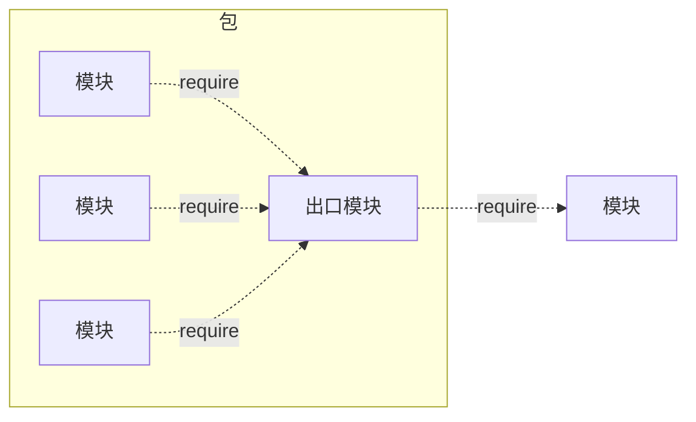

<!--more-->

---

---

**这是我参与8月更文挑战的第17天，活动详情查看：[8月更文挑战](https://juejin.cn/post/6987962113788493831 "https://juejin.cn/post/6987962113788493831")**


# 包与NPM

Node组织了自身的核心模块，也使得第三方文件模块可以有序的编写和使用。

但是在第三方模块中，模块与模块之间仍然是散列在各地的，**相互之间不能直接引用**

所以在模块外，包和NPM是将模块联系起来的机制。


* 包组织模块示意图


CommonJS 的包规范定义其实也很简单，由包结构和包描述文件两部分组成。

## 包结构

用于组织包中的各种文件，是一个存档文件，即一个目录直接打包为.zip或tar.gz格式的文件。

> 符合规范的包目录：
> * package.json: 包描述文件
> * bin: 用于存放可执行二进制文件的目录
> * lib: 用于存放JavaScript代码的目录
> * doc: 用于存放文档的目录
> * test: 用于存放单元测试用例的代码

## package.json包描述文件

NPM所有行为都与包描述文件的字段息息相关

一些字段：
* name: 包名。 规范定义需要用小写的字母和数字组成，`不允许出现空格`。 包名必须是唯一的，以免对外公布时产生重名冲突
* description: 包简介
* version: 版本号，关于其介绍在[《Node.js学习（一）——简介》](https://juejin.cn/post/6943135199400034312 "https://juejin.cn/post/6943135199400034312")也有提及
* keywords: 关键字数组， NPM中主要用来作分类搜索。
* maintainers: 包维护者列表。 每个维护者由`name、email和web`这3个属性组成。 NPM通过这个属性进行权限认证。

    格式： 
    ``` javascript
        "maintainers":[{ "name":"kongchengji", "email":"111@.com", "web":"[http:](https://blog.csdn.net/qq_36171287)" }]
    ```
* contributors: 贡献者列表，格式与维护者列表相同
* bugs: 一个可以反馈bug的网页地址或邮件地址
* licenses: 当前包所使用的许可证列表，表示包在哪些许可证下使用

    格式：
    ``` javascript
     "licenses":[{ "type": "GPLv2", "url":"" }]
     // 或者
     "license": "ISC"
    ```
* repositories: 托管源代码的位置列表，表明可以通过哪些方式和地址访问包源代码。   
    格式：
    ``` javascript
    "repository": {
    "type": "git",
    "url": "git+https://github.com/kongchengji/UiSelfMade.git"
  },
    ```
* dependencies: **使用当前包所需要依赖的包列表**。 这个属性非常重要
* homepage: 当前包的网站地址
* os: 操作系统支持列表， 如果列表为空，则不对操作系统做任何假设
* cpi: CPU架构支持列表
* engine：支持的JavaScript引擎列表
* directories：包目录说明
* implements： 实施规范的列表。 标志当前包实现了CommonJS哪些规范
* scripts： 脚本说明对象。 主要用于被包管理器用来安装、编译、测试和卸载包

    格式：
    ``` javascript
        "scripts": {
            "dev": "webpack-dev-server --inline --progress --config build/webpack.dev.conf.js",
            "start": "npm run dev",
            "lint": "eslint --ext .js,.vue src",
            "build": "node build/build.js"
        },
    ```

NPM与包规范区别在于多了四个字段：
* author： 包作者 :ok_man:
* bin: 一些包作者希望包可以作为命令行工具使用。 
* main: 模块引入包时，会有限检查这个字段，并将其作为包中其余模块的入口模块。 如果不存在，require会查找包目录下的index.js、index.node、index.json作为默认入口
* devDependencies： 一些模块只在开发时需要依赖。
    > devDependencies：开发环境使用
    > dependencies：生产环境使用 


<br/><br/>

***

## 前后端共用模块 

JavaScript在Node出现后，有一项优势 --> 一些模块可以在前后端实现共用。

但是前后端上始终还是有一些差别的 :sweat_drops:


### 前后端模块侧重点

前后端JavaScript分别搁置在HTPP的两端，扮演的角色并不同。

> 浏览器端的JavaScript需要经历从同一个服务器端分发到多个客户端执行，瓶颈是带宽，从网络加载代码
> 服务器端的JavaScript是相同代码需要多次执行，瓶颈是CPU和内存等资源，从磁盘中加载

在前端JavaScript中，主要还是应用**AMD规范**。  

CommonJS并不完全适用于前端JavaScript，比如Node的模块引入基本是同步的，但是前端引入如果使用同步引入，UI在初始化过程中需要花费很多时间等待脚本加载完成。

#### AMD规范
AMD规范 是`CommonJS`规范的一个延伸，全称：`Asynchronous Module Definition`。
是异步模块定义

模块定义：`define(id?, dependencies?, factory);` 
id 是模块的名字，它是可选的参数。

dependencies 指定了所要依赖的模块列表，它是一个数组，也是可选的参数

AMD需要在声明模块时指定所有的依赖，通过形参传递依赖到模块内容中：
``` javascript
define(['./a', './b'], function (dep1, dep2) {
    a.doSomethimg()
    b.doSomething()
});
```

#### CMD规范
与AMD规范相对的还有CMD规范，全称：`Common Module Definition`。
是公共模块定义

这是由国内的玉伯（也是一位大佬）提出的

模块定义：`define(factory)`

CMD支持动态引入：
``` javascript
define(function(require, exports, module) {
    var a=require('./a')
    a.doSomethimg()
    var b=require('./b')
    b.doSomething()
})
```
在需要依赖模块时， 随时调用require()引入即可

* CMD 推崇依赖就近; AMD 推崇依赖前置
* CMD 是延迟执行; AMD 是提前执行
* CMD性能好,因为只有用户需要的时候才执行; AMD用户体验好,因为没有延迟,依赖模块提前执行了

AMD和CMD最大的区别是对依赖模块的执行时机处理不同

### 兼容多种模块规范

创建一个hello方法，让hello方法能在不同运行环境中运行，兼容Node、AMD、CMD和常见浏览器
* 匿名函数前加一个;是个好习惯  name是方法名，definition是方法体
* 通过`typeof`检测环境是否为AMD或CMD还是Node环境
* 可以将模块执行结果挂载在window变量中，这样可以直接调用

``` javascript
// 匿名函数前加一个;是个好习惯  name是方法名，definition是方法体
;(function (name, definition) {
    //检查环境是否是AMD或CMD
    var hasDefine = typeof define === 'function',
    // 检查环境是否为Node
    hasExports = typeof module !== 'undefined' && mudule.exports;

    if(hasDefine) {
        define(definition);
    } else if (hasExports) {
        module.exports = definition();
    } else {
        // 将模块的执行结果挂在window变量中，在浏览器中this指向window对象
        this[name] = definition();
    }
})('hello', function () {
    var hello = function () {
        console.log('hello');
    }
    return hello;
});
```


