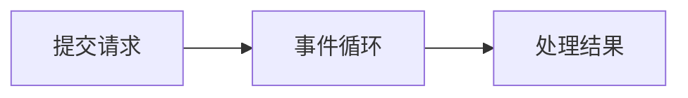

<!--more-->

---

---
**这是我参与8月更文挑战的第18天，活动详情查看：[8月更文挑战](https://juejin.cn/post/6987962113788493831 "https://juejin.cn/post/6987962113788493831")**

# 异步I/O

在前端，最经典的异步就是**Ajax**

文章介绍：[《高性能 JavaScriptの六 -- 老生常谈 Ajax》](https://blog.csdn.net/qq_36171287/article/details/117201363)


Node是首个大规模将异步I/O应用在应用层上的平台，力求在单线程上将资源分配的更高效

为了弥补单线程无法利用多核CPU的缺点，Node提供了类似前端浏览器中Web Workers的子进程，子进程可以通过工作进程高效的利用CPU和I/O


Node异步I/O基本要素：
* 事件循环： 
* 观察者：
* 请求对象
* I/O线程池

事件循环是一个典型的生产者/消费者模型。 异步I/O、网络请求是事件生产者，为Node提供不同类型的事件，事件被传递到对应的观察者那里，事件循环从观察者那取出事件并处理

官方介绍：http://nodejs.cn/learn/the-nodejs-event-loop

异步流程


node中使用import： https://blog.csdn.net/goutinga/article/details/108074649


测试代码：
``` javascript
import { nextTick } from 'process';

module.exports = function (app) { 
    nextTick(() => console.log(1));  // 优先级第二
    setImmediate(() => console.log(2));  // 优先级最低
    Promise.resolve().then(() => console.log(3)); // 优先级第三
    queueMicrotask(() => console.log(4));  // 优先级第四
    setTimeout(() => console.log(6), 0);  // 优先级第五
    console.log(5)  // 优先级最高
}
```

**输出的顺序：5  1  3  4  6  2**

这里可以发现，`nextTick`中回调函数的执行优先级最高，而`setImmediate`的执行优先级最低。

> 原因在于事件循环对观察者的检查是有先后顺序的， `nextTick`属于idle观察者， `setImmediate`属于check观察者。 idle观察者先于I/O观察者， I/O观察者先于check观察者 


<br/>

## 异步编程 🐟

### 高阶函数

在通常的语言中，函数的参数只接受基本的数据类型或是对象引用，返回值也只是基本数据类型和对象引用。

基本函数：
``` javascript
function foo(x) { 
    return x;
}
```

高阶函数是可以把函数作为参数，或是将函数作为返回值

高阶函数：
``` javascript
function foo(x) {
    return function () {
        return x;
    };
}
```

### 偏函数

偏函数用法指创建一个调用另外一个部分（参数或变量已经预置的函数）的函数用法

举个粒子, 定义判断类别的方法：
``` javascript
var toString = Object.prototype.toString;

var isString = function(obj) {
    return toString.call(obj) == '[object String]';
}
var isFunction = function(obj) {
    return toString.call(obj) == '[object Function]';
}
```

如果需要重复定义一些相似的函数，这样代码就会冗余。 为了解决重复定义的问题，可以创建一个新函数：
``` javascript
var isType = function(type) {
    return function(obj) {
        return toString.call(obj) == '[object ' + type + ']';
    }
}

var isString = isType('String');
var isFunction = isType('Function');
```

这种`通过指定部分参数来产生一个新的定制函数的形式就是`**偏函数**

<br><br>

***
### 异常处理

在普通异常处理当中，通常使用`try/catch/final`语句块进行异常捕获。

但是这在异步编程中并不一定使用。 异步I/O实现主要包涵在两个阶段：1、提交请求  2、处理结果。

这两个阶段中间有`事件循环`的调度，所以彼此不关联


<div color=#f00 size=3 >**Node在处理异常上形成了一种约定，将异常作为回调函数第一个实参传回，如果为控制，则表明异步调用没有异常抛出。**</div>

JavaScript的 try…catch 机制不能用来截获异步方法产生的错误。**新手的常见错误之一是试图在错误优先回调函数中使用 throw**

参考：[《错误优先的回调》](http://nodejs.cn/api/errors.html#errors_error_first_callbacks)

错误例子：
```javascript
const fs = require('fs');

try {
  fs.readFile('/some/file/that/does-not-exist', (err, data) => {
    // 错误的假设：在这里抛出错误。
    if (err) {
      throw err;
    }
  });
} catch (err) {
  // 这里不会截获回调函数中的 throw。
  console.error(err);
}
```

会出现报错：


***
正确例子：

``` javascript
function errorFirstCallback(err, data) {
    if (err) {
      console.error('出错', err);
      return;
    }
    console.log(data);
}
fs.readFile('./src/b.txt', errorFirstCallback)
```

<br><br>

***
## 异步编程解决方案 🐳

异步编程主要解决方案有三种

* 事件发布/订阅模式
* Promise/Deferred模式
* 流程控制库


### 事件发布/订阅模式

事件监听器模式是一种广泛用于异步编程的模式，是回调函数的事件化，又称发布/订阅模式。

Node自身提供的events事件触发器模块是发布/订阅模式的一个简单实现。

**所有触发事件的对象都是 `EventEmitter` 类的实例**。 这些对象暴露了 `eventEmitter.on()` 函数，允许将一个或多个函数绑定到对象触发的命名事件。 通常，事件名称是驼峰式字符串，但也可以使用任何有效的 `JavaScript` 属性键。

当 `EventEmitter` 对象触发事件时，所有绑定到该特定事件的函数都会被同步地调用。 被调用的监听器返回的任何值都将被忽略和丢弃。

以下示例展示了使用单个监听器的简单的 EventEmitter 实例。 `eventEmitter.on()` 方法用于注册监听器，`eventEmitter.emit()` 方法用于触发事件

### 简单例子

``` javascript
const { EventEmitter, errorMonitor } = require('events');

class MyEmitter extends EventEmitter {}

const myEmitter = new MyEmitter();
// 订阅
myEmitter.on('event1', (val) => {
  console.log(val);
});
// 发布
myEmitter.emit('event1', 'hello world!');
```

结果：在订阅中输出 hello world!


订阅函数就是一个高阶函数的应用， 事件发布/订阅模式可以实现一个事件与多个回调函数的关联，这些回调函数又被称为<div color=#CE5CEA size=2 >**事件监听器**</div>

通过`emit()`发布事件后，消息回立即传递给当前事件的所有监听器执行，监听器可以<div color=#65CE23  >添加和删除</div>。

在Node中， `emit()`调用多半是伴随事件循环而异步触发的。

### 监听器过多警告

> 注意：
> 如果一个事件添加了超过10个监听器，将会得到一条警告。 并且事件相关的监听器过多，可能存在过多占用CPU的情景。
> 
``` javascript
for (let i = 0; i < 11; i++) {
    myEmitter.on('event1', (val) => {
        console.log(i);
    });
}
// 发布
myEmitter.emit('event1', 'hello world!');
```
 


如果想要<div color=#CE9123 >**去除警告**</div>，调用`setMaxListeners(0);`可以去除限制

`myEmitter.setMaxListeners(0);` 添加在for循环前即可
