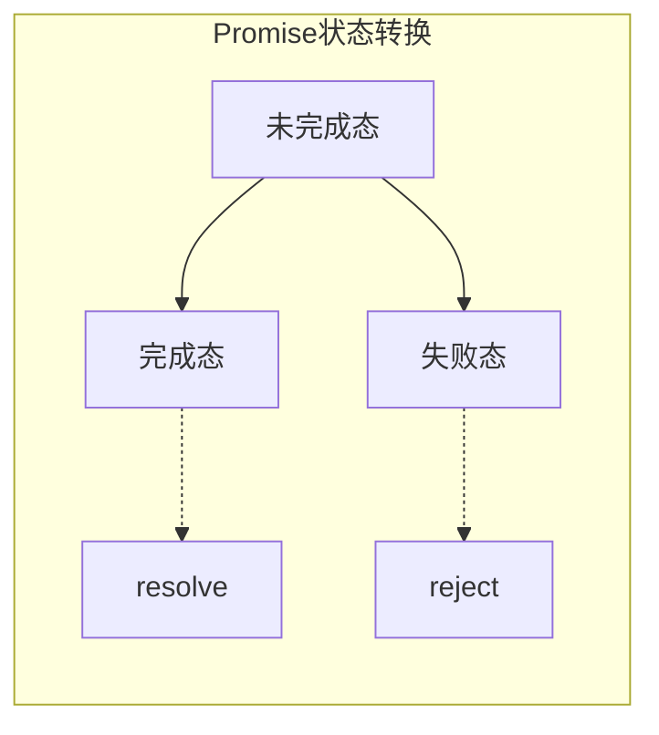
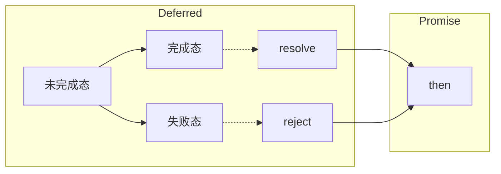

<!--more-->

---

---

**这是我参与8月更文挑战的第31天，活动详情查看：[8月更文挑战](https://juejin.cn/post/6987962113788493831 "https://juejin.cn/post/6987962113788493831")**


## Promise/Deferred模式 🎱

使用事件的方式是，执行流程需要被预先设定，即使是分支，也需要预先设定，这是由**发布/订阅模式**的运行机制所决定的。

但是在**Promise/Deferred模式**中，采用先执行异步调用，延迟传递处理的方式

**promise/deferred** 模式是，根据**promise/A** 或者它的增强修改版**promise/A+** 规范 实现的promise异步操作的一种实现方式。

在原始的API中，一个事件只能处理一个回调。而通过**Deferred**对象，可以对事件加入任意的业务处理逻辑。

比如：
``` javascript
$.get('/api')
.success(fun1)
.success(fun2)
```

该模式包括两个部分： **promise** 和 **deferred**


### Promise ⚽

Promise对象有以下两个特点（下面这两点也是官方最精华的总结）:

（1）**对象的状态不受外界影响**。`Promise`对象代表一个异步操作，有三种状态：`pending`（进行中）、`fulfilled`（已成功）和`rejected`（已失败）。只有异步操作的结果，可以决定当前是哪一种状态，任何其他操作都无法改变这个状态。这也是`Promise`这个名字的由来，它的英语意思就是“承诺”，表示其他手段无法改变。

（2）**一旦状态改变，就不会再变**，任何时候都可以得到这个结果。`Promise`对象的状态改变，只有两种可能：从`pending`变为`fulfilled`和从`pending`变为`rejected`。只要这两种情况发生，状态就凝固了，不会再变了，会一直保持这个结果，这时就称为 `resolved`（已定型）。如果改变已经发生了，你再对`Promise`对象添加回调函数，也会立即得到这个结果。这与事件（`Event`）完全不同，事件的特点是，如果你错过了它，再去监听，是得不到结果的。



**阮一峰老师的Promise**： https://www.bookstack.cn/read/es6/docs-promise.md

#### 模拟Promise ⚾

对于**Promise**对象，只要具备`then()`方法即可。

对`then()`方法的要求：
* 接受完成态、错误态的回调方法，在操作完成或者出现错误时，调用对应方法
* 可选地支持progress事件回调作为第三个方法
* `then()`方法只接受function对象，其他对象将被忽略
* `then()`方法继续返回**Promise**对象，以实现链式调用
* `then()`方法定义：`then(fulfilledHandler, errorHandler, progressHandler)`

例子：
``` javascript
class PromiseMade extends EventEmitter{
    constructor() {
        super();
    }
    then(fulfilledHandler:Function, errorHandler:Function, progressHandler?:Function) {
        
        this.once('success', fulfilledHandler);
        this.once('error', errorHandler);
        // this.on('progress', progressHandler);
        return this;
    }
}

class DeferredMade {
    promise:PromiseMade;
    state: string;
    constructor() {
        this.state = 'pending';
        this.promise = new PromiseMade();
    }
    resolve(obj: Function) {       
        this.state = 'fulfilled';        
        this.promise.emit('success', obj);
    }
    reject(err: Function) {
        this.state = 'rejected';
        this.promise.emit('error', err);
    }
    progress(data: Function) {
        this.promise.emit('progress', data);
    }
}
```

此时的`DeferredMade`类就类似于`promise`，在调用时可以放在一个函数中模拟使用：
```javascript
function kwait() {
    let deferred = new DeferredMade();
    setTimeout(()=>{
        deferred.resolve(()=> {
            console.log('成功了');
        });
    }, 3000)
    return deferred.promise;
}
IO.get('/txt', (req, res)=>{
    let num = kwait();
    num.then(()=>{
        console.log('成功了');
        res.json({ d: '123' })   
    },()=>{
        console.log('失败了');
    })
})
```


从这里的代码上，可以看到`Promise`和`Deferred`的差别：
* `Deferred`主要是作用于内部，用于维护异步模型的状态
* `Promise`主要作用于外部，通过`then()`方法暴露给外部添加自定义逻辑

`Promise`和`Deferred`的关系：


***
<br>

### 适用情况 🏀

与**发布/订阅模式**相比，**Promise/Deferred模式**的接口和模型都非常简洁。

将业务中不可变的部分封装在了Deferred，可变部分交给了Promise。

对于不同的场景，都需要去封装和改造其Deferred。 

**如果场景不常用，封装花费的事件与带来的效率相比并不划算。**

1. Promise是高级接口，一旦定义，不太容易变化，但对典型问题解决非常有效
2. 事件是低级接口，可以构成更多复杂的场景

***
<br>

### 流程控制库 🏈

在express当中，还有一类需要手工调用才能持续执行后续调用的方式，这类方法叫做**尾触发**，常见的是**next**。

在express中，就会有next在编写中间件时较为常用。

参考：https://www.jianshu.com/p/6322c32001b7

<br>

***
<br>

## 总结 🎳

在Node异步处理过程中，最常使用的就是事件发布订阅和Promise了，当然流程控制库的方式也会用大。 对于不同的场景，需要采取最使用的方法，这一点就需要依靠自身判断了，毕竟谁也不知道后续会不会**加需求** （*真的对后期需求变更是深恶痛绝*）

