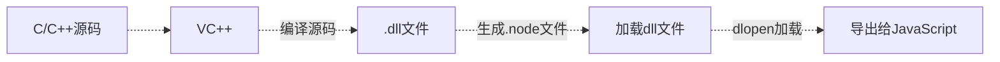

<!--more-->

---

---
**这是我参与8月更文挑战的第15天，活动详情查看：[8月更文挑战](https://juejin.cn/post/6987962113788493831 "https://juejin.cn/post/6987962113788493831")**

# NodeJs

虽然曾经在以前写过nodeJs的一篇文章，不过系统性的开始学习还是从现在开始吧。（不过我也同时在学`TypeScript`，所以`NodeJs`不能保证不间断学习）

以前学过些：[《Node.js学习（一）——简介》](https://juejin.cn/post/6943135199400034312)

Node.js是一个基于chrome V8引擎的JavaScript运行环境
node.js不是语言，不是服务器，不是数据库。

本次我的node学习，直接从`node`的`express`框架开始来代替`http模块`，`express`学习可参考：http://javascript.ruanyifeng.com/nodejs/express.html

`express`是Node一个很经典的框架，也是当今全球最流行的

比如下面的例子：
入口app.js
``` javascript
const express = require('express');  // 直接用express代替http, 因为express底层是基于http模块

var app = express();

// 将app的监听都存放到另外一个router的index.js当中
const routes = require('./routes')(app);

//服务器本地主机的数字
app.listen('3001',function(){
    console.log("启动了。。。, 运行 http:localhost:3001/AjaxTest/app.html ")
})
```


Node保持了JavaScript中的单线程特点

单线程最大的好处**在于不用处处在意状态的同步问题**

**坏处：**
* 无法利用多核CPU
* 错误会引起整个应用退出，应用的健壮性值得考验
* 大量计算占用CPU导致无法继续调用异步I/O


## Node解决单线程计算量大问题：
与`Web Workers`类似，node中有`child_process`子进程

Web Workers的优点和限制以前也写过：https://blog.csdn.net/qq_36171287/article/details/117172844

`child_process`子进程的出现，意味着Node考研应对单线程在健壮性和无法利用多核CPU方面的问题。通过将计算分发到各个子进程，考研将大量计算分解掉，然后再通过进程之间的事件消息来传递结果。


# 模块机制

JavaScript先天缺少一项功能：模块。 
* python有import机制
* Ruby有require
* PHP有include和require

而JavaScript通过`<script>`标签引入代码的凡是显得杂乱无章，所以社区也为JavaScript制定了相应的规范，其中CommonJS规范就是最重要的里程碑，现在还有es6提出的Module

参考文章：http://javascript.ruanyifeng.com/nodejs/module.html

## Node模块规范
Node采用CommonJS规范，CommonJS对模块的定义十分简单，主要分为模块引用、模块定义和模块标识3个部分。

1. 模块引用
    模块引用示例（可以不引入扩展名）：
    ``` javascript
    var math = require('math')
    ```

2. 模块定义
    在模块中，存在一个module对象，代表模块本身。exports是module的属性，exports对象用于导出当前模块的方法或者遍历，并且是**唯一**导出的出口。在node中，一个文件就是一个模块，将方法挂载在exports对象上作为属性就算定义导出的方式
    ``` javascript
    // math.js
    exports.add = ()=>{
        let sum = 0, i = 0, args = arguments, l = args.length;
        while(i < l) {
            sum += args[i++];
        }
        return sum;
    }
    ```

3. 模块标识
    模块标识其实就算传递给require()方法的参数，必须是符合小驼峰命名的字符串，或者以.、..开头的相对路径或者绝对路径。 可以没有文件后缀名
    模块的定义十分简单，接口也十分简洁。意义在于将类聚的方法和变量等限定在私有的作用域中，同事支持引入和导出功能以顺畅地连接上下游依赖。

## Node中模块的分类
* 核心模块（已经封装好的内置模块）
* 自定义模块
* 第三方的模块（npm下载来的模块）

## Node模块实现
node中引入模块，需要经历如下三个步骤：
1. 路径分析
2. 文件定位
3. 编译执行

核心模块在node编译过程中编译进了二进制执行文件，在node进程启动时，部分核心模块被直接加载进内存中，所以这部分核心模块引入时文件定位和编译执行可以忽略，并且在路径分析中有限判断。所以**核心模块加载速度最快**

## 优先从缓存加载

与前端浏览器会缓存静态脚本文件以提高性能一样，Node对引入过的模块都会进行缓存，以减少二次引入时的开销。 

不同的地方在于，浏览器仅仅缓存文件，而Node缓存的是编译和执行之后的对象。

不论是核心模块还是文件模块，`require()方法对相同模块的二次加载都一律采用缓存优先的方式`，这是第一优先级的。不同之处在于核心模块的缓存检查先于文件模块的缓存检查。

## 文件扩展名分析
require()在分析标识符的过程中，会出现标识符中不包含文件扩展名的情况。 CommonJS模块规范也允许在标识符中不包含文件扩展名，这种情况下，Node会按.js、.node、.json的次序补足扩展名后尝试。

在调用过程中，需要fs文件读取模块同步阻塞式地判断文件是否存在，因为node是单线程的。 

> 小技巧: 
> * 如果是node和json文件，在传递时将扩展名加上，会提升速度。
> * 同步配合缓存，可以大幅度缓解node单线程中阻塞式调用的缺陷 


***

## 模块编译

在Node中，每个文件模块都是一个对象

文件模块定义如下：
``` javascript
function Module(id, parent) {
    this.id = id;
    this.exports = {};
    this.parent = parent;
    if (parent && parent.children) {
        parent.children.push(this);
    }

    this.filename = null;
    this.loaded = false;
    this.children = [];
}
```

对于不同的文件扩展名，node的载入方法也不同：
* .js文件。 通过fs模块同步读取文件后编译执行
* .node文件。 这是用C/C++编写的扩展文件，通过dlopen()方法加载最后编译生成的文件
* .json文件。 通过fs模块同步读取文件后，用JSON.parse()解析返回结果
* 其余扩展名文件。 **都会被当作.js文件载入**

每个编译成功的模块，都会将文件路径作为索引缓存在Module._cache对象上，以提升二次引入的性能。
可以使用`console.log(require.cache)`打印查看

***

### JavaScript模块的编译

在node的API文档中，知道每个模块中还有`_filename`和`_dirname`这两个变量。 如果把直接定义模块的过程放在浏览器端，会存在污染全局变量的情况。

所以，node对获取的JavaScript文件内容进行了头尾包装。

一个正常的JavaScript文件会被包装成如下：
``` javascript
(function(exports, require, module, _filename, _dirname){
    var math = require('math');
    exports.area = function (radius) {
        return Math.PI * radius * radius;
    }
})
```
这样，每个模块文件之间都进行了作用域隔离。 包装后的代码会通过**vm原生模块**的runInThisContext()方法执行,然后返回一个function对象。

exports属性上的任何方法和属性都可以被外部调用到，但是模块中其余变量或属性则不可直接被调用。

> **vm原生模块**：vm 是 nodejs 的一个核心模块，使用 vm 模块可以在 v8 虚拟机上下文中编译运行代码。JavaScript 代码可以被立即编译运行，也可以编译保存稍后运行。利用 vm 模块，我们可以使得 nodejs 动态执行代码，服务的扩展性，动态性更好

exports不能直接赋值，原因是由于exports对象是通过形参的方式传入的，直接赋值会改变形参的引用


如果需要直接赋值，那么就给module.exports这个对象

### C/C++模块的编译

.node模块文件不需要编译，因为是编写C/C++模块之后编译生成的，所以只有加载和执行过程。 C/C++模块通过预先编译成.node文件，然后调用process.dlopen()方法加载执行。

在执行过程中，模块的exports对象与.node模块产生联系，返回给调用者。 

Windows下编译和执行过程：


C/C++模块
* 优势主要是执行效率
* 劣势是C/C++模块编写门槛高

### JSON文件的编译
.json文件的编译是三种编译方式中最简单的。 利用fs文件读取模块同步读取json文件的内容后，调用JSON.parse()方法得到对象，然后赋值给模块对象的exports。


***

## 模块依赖


文件模块可能会依赖于核心模块，核心模块可能会依赖于内建模块


**文件模块不推荐直接调用内建模块**