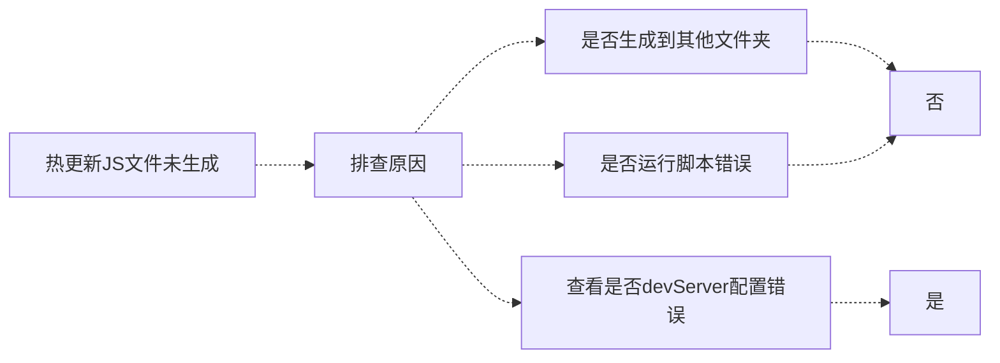

# webpack5热更新打包

热更新，是指 **Hot Module Replacement**，缩写为 **HMR**。

**模块热替换**（**HMR** - Hot Module Replacement）是 webpack 提供的最有用的功能之一。它允许在运行时替换，添加，删除各种模块，而无需进行完全刷新重新加载整个页面

当然这次主要是为了打包我写的`typescript`，为了修改ts后能够时时更新出js文件。 

## 配置准备

在之前的文章 《[从0开始的TypeScriptの五：webpack打包typescript](https://juejin.cn/post/6992956547252879374)》里面，关于webpack如何打包ts文件已经讲过一次，需要安装的插件还是需要继续依赖

插件：
* typescript
* webpack 
* webpack-cli 
* ts-loader

本次热更新对应还需要多安装一个包，叫做`webpack-dev-server`

> 安装命令： yarn add webpack-dev-server

我的这四个包的版本(这里可以注意一下，我的`webpack`版本已经是5了)：
``` js
"typescript": "^4.3.5",
"webpack": "^5.48.0",
"webpack-cli": "^4.7.2",
"webpack-dev-server": "^3.11.2"
```

此时需要在根目录下创建`webpack.config.js`文件，这个文件的配置在此系列[上一篇文章](https://juejin.cn/post/6992956547252879374)中已经有写过，不过现在需要多增加`devServer`和`plugins`配置。

之前的`webpack.config.js`文件
```js
const path = require('path');   
const webpack = require('webpack');
module.exports = {
  entry:'./TypeScript/tsc05.ts',   // 打包对入口文件，期望打包对文件入口。 这里配置tsc05.ts的位置
  output:{
    filename:'tsc_out.js',   // 输出文件名称
    path:path.resolve(__dirname,'./TypeScript/')  //获取输出路径
  },
  mode: 'development',   // 整个mode 可以不要，模式是生产坏境就是压缩好对，这里配置开发坏境方便看生成对代码
  module:{
  rules: [{
      test: /\.tsx?$/,
      use: 'ts-loader',
      exclude: /node_modules/
    }]
  },
  resolve: {
    extensions: ['.ts']      // 解析对文件格式
  },
}
```

在**module.exports**内增加的配置代码如下：

> 通过 **webpack-dev-server** 的这些配置，能够以多种方式改变其行为

``` js
devServer: {
    liveReload: true,  // liveReload替代hot进行热更新
    port: 9000,   // 端口号
    filename: 'tsc_out.js',   // 输出文件名称
},
plugins: [
    //热更新插件
    new webpack.HotModuleReplacementPlugin()  // 在最开始需要引入 const webpack = require('webpack');
]
```

这里很有可能在后面运行时出现报错，原因是webpack未找到， 如果此前没有在`webpack.config.js`引入webpack，此时需要引入一下
```js
const webpack = require('webpack');
```

`webpack.config.js`配置好了之后，在根目录的`package.json`文件中，添加`script`运行脚本 start
```
"scripts": {
    "dev": "webpack --mode development",
    "start": "webpack serve --config webpack.config.js --mode development"
}
```


> **注意：** 这里千万要注意，start的运行命令要写作`webpack serve`而不是`webpack-dev-server`

因为使用`webpack-dev-server`是webpack5以前的方式了，如果使用，就会在`npm run start`运行时发生报错，错误信息为： `Error: Cannot find module 'webpack-cli/bin/config-yargs'`

参考文档：[https://webpack.docschina.org/configuration/dev-server/](https://webpack.docschina.org/configuration/dev-server/)


运行命令配置错误：


运行命令配置后运行成功：


<br>

***

<br>

## 艰难的配置之路

接下来就开始了更加艰辛的配置过程了


当然此时配置成功，并且npm run start命令成功运行起来后，发现又出现了一堆报错，主要都是`Module not found: Error: Can't resolve`错误。


然后我又开始疯狂找原因，进入错误的文件夹`webpack-dev-server\client`下面，找到`index.js`文件。 发现错误都出现在`require`导入中。


> **原因：**`require`导入是`CommonJS标准`，这是主要出现在node中的方式。 所以需要在`webpack.config.js`中配置`target`

> 具体配置可查官网：https://webpack.docschina.org/configuration/target/

> 构建目标(Targets)

> webpack 能够为多种环境或 target 构建编译。target 告知 webpack 为目标(target)指定一个环境。默认值为 "browserslist"，如果没有找到 browserslist 的配置，则默认为 "web"


所以将`target`设置成为'node'即可， `webpack.config.js`配置文件中添加`target: 'node'`

这下使用`npm run start`命令成功运行起来了，并且**好像**没有报错啦。


<br>

***

<br>

现在运行`npm run start`命令，出现了下面的运行结果：


既然说 `Compiled successfully.`已经成功，那么在相应的TypeScript文件夹下应该有对应的**tsc_out.js**生成了。 

**但是**，我没找到生成的js文件，不应该呀。 然后赶紧排查原因：



发现使用热更新命令运行虽然成功了，但是热更新是编译的文件是存放在**内存**当中的，所以肯定在相应配置的`output`输出位置找不到对应的打包文件了

如果想要在对应位置热更新后产生相应的输出文件，需要在`webpack.config.js`中配置`devServer`时多添加一句：<div color=#8F08DA >**writeToDisk: true**</div> 

这句命令可以将产生的文件写入硬盘。 写入位置为 `output.path` 配置的目录 （`writeToDisk`我其实找了好久，才在官方文档中找到的，泪目）

``` javascript
devServer: {
    progress: false,  // 命令行中会显示打包的进度
    liveReload: true,
    port: 9000,
    filename: 'tsc_out.js',
    writeToDisk: true,  // 将产生的文件写入硬盘。 写入位置为 output.path 配置的目录
  },
```

此时，使用热更新`npm run start`命令运行后，就会产生对应的**tsc_out.js**文件了

<div color=#f00 >**不过**</div> ，每次更新ts后，虽然相应的tsc_out.js文件会自动改变，但是每次更新保存后也会多出两个**main.xxx.js**文件


所以这种情况依旧要需靠配置避免。

可以给 **devServer.writeToDisk** 传入一个函数用来筛选哪些文件需要写入硬盘。 使用正则表达式来对写入硬盘的文件名次进行筛选
``` javascript
writeToDisk: (filename) => {
  return /tsc_out.js/.test(filename);
}
```

成功效果：


至此，通过`webpack`进行热更新后时时打包生成`typescript`的编译js文件就完成了

<br>

***

<br>

## 总结

这次的热更新打包过程真的是跌跌撞撞，一个萝卜一个坑。

本篇文章的重点其实并不在于如何打包`typescript`，反而是在于如何配置`webpack`的热更新`devServer`

关于如何在`webpack5`中配置`typescript`，我发现在官方网站上也有说明：[https://webpack.docschina.org/guides/typescript](https://webpack.docschina.org/guides/typescript/)

虽然遇到了许多麻烦和报错，不过最终还是完成了配置


